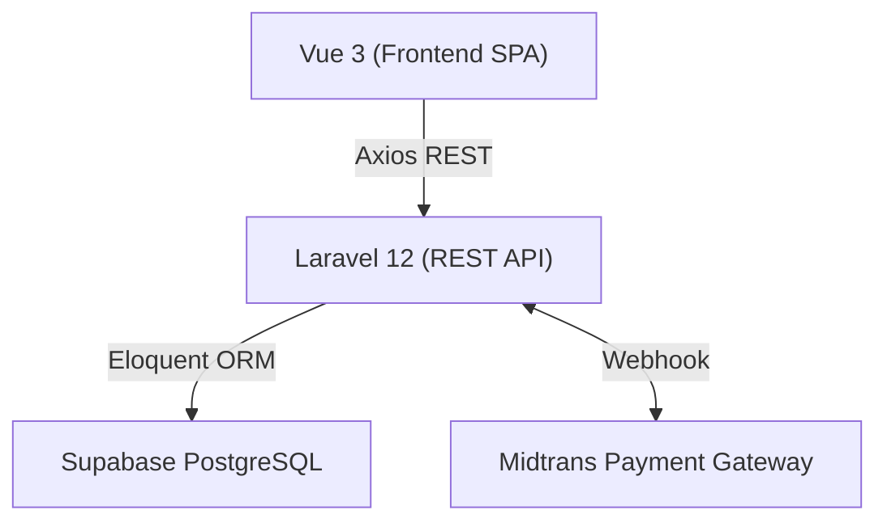

<div align="center">
  
  <h1>e-Ticket Sarangan</h1>
  <p>Sistem Digital Ticketing dan Manajemen Pengunjung untuk Wisata Telaga Sarangan</p>
  
  <p>
    
    
    
    
  </p>
</div>

---

## 📋 Ikhtisar Proyek

**e-Ticket Sarangan** adalah platform manajemen tiket berbasis web yang dirancang untuk modernisasi infrastruktur pariwisata Telaga Sarangan. Sistem ini menggunakan arsitektur monorepo yang memisahkan *backend* (API) dan *frontend* (SPA) dengan performa tinggi.

Sistem ini mendukung integrasi gerbang pembayaran otomatis, pembuatan QR Code tiket, dan manajemen pengunjung secara terpusat untuk berbagai peran pengguna (Wisatawan, Petugas, dan Administrator).

## 🏗 Arsitektur Sistem

Aplikasi ini menggunakan pendekatan arsitektur klien-peladen (*client-server*) modern:



Struktur Monorepo:
- `backend/` : Layanan REST API berbasis Laravel 12 dan PHP 8.3+.
- `frontend/` : Antarmuka Single Page Application berbasis Vue 3, Vite, dan TypeScript.
- `docs/` : Dokumentasi teknis terperinci.

## 💻 Tumpukan Teknologi (Tech Stack)

### Antarmuka (Frontend)
- **Framework:** Vue 3 (Composition API)
- **Bahasa:** TypeScript (Strict Mode)
- **Build Tool:** Vite
- **Manajemen State:** Pinia
- **Pengaturan Rute:** Vue Router
- **HTTP Client:** Axios
- **Gaya Desain:** Tailwind CSS
- **Ikonografi:** Lucide Vue Next

### Layanan Latar Belakang (Backend)
- **Framework:** Laravel 12
- **Bahasa:** PHP 8.3+
- **Keamanan:** Laravel Sanctum (Autentikasi Berbasis Token)
- **Basis Data:** PostgreSQL (Optimasi untuk Supabase)
- **Payment Gateway:** Midtrans Snap API

## ⚙️ Persyaratan Sistem (Prerequisites)

Sebelum melakukan instalasi, pastikan sistem Anda telah memiliki komponen berikut:

- PHP versi 8.3 atau yang lebih baru (dengan ekstensi `pdo_pgsql`, `pgsql`).
- Composer versi 2.x.
- Node.js versi 20.19 atau yang lebih baru (versi 22 disarankan).
- NPM versi 10 atau yang lebih baru.
- Layanan PostgreSQL (Bisa menggunakan instalasi lokal atau layanan *cloud* seperti Supabase).

## 🚀 Panduan Instalasi

### 1. Kloning Repositori

```bash
git clone https://github.com/Kanzacky/E-Ticket-Sarangan.git
cd E-Ticket-Sarangan
```

### 2. Konfigurasi Backend

Masuk ke direktori backend dan jalankan perintah instalasi dependensi:

```bash
cd backend
composer install
```

Salin pengaturan lingkungan dan sesuaikan nilainya:

```bash
cp .env.example .env
php artisan key:generate
```

Ubah berkas `.env` Anda dengan kredensial basis data PostgreSQL Anda. Setelah selesai, jalankan migrasi:

```bash
php artisan migrate
php artisan serve
```
Layanan API akan berjalan di `http://localhost:8000`.

### 3. Konfigurasi Frontend

Masuk ke direktori frontend:

```bash
cd ../frontend
npm install
```

Salin pengaturan lingkungan:

```bash
cp .env.example .env
```

Jalankan server pengembangan:

```bash
npm run dev
```
Aplikasi klien akan berjalan di `http://localhost:5173`.

## 🧪 Pengujian Perangkat Lunak (Testing)

Kami menjaga kualitas kode perangkat lunak melalui pengujian otomatis (*automated testing*).

**Pengujian Backend (PHPUnit):**
```bash
cd backend
php artisan test
```

**Pengujian Frontend:**
```bash
cd frontend
npm run type-check  # Pengecekan tipe data statis
npm run lint        # Analisis kualitas kode sumber
```

## 🔐 Manajemen Akses dan Peran (Role-Based Access Control)

Sistem ini memfasilitasi tiga lapisan hak akses:

| Peran | Deskripsi Fungsionalitas |
|:---|:---|
| **Wisatawan** | Memiliki akses untuk melakukan reservasi tiket, melihat status pembayaran, dan menampilkan QR Code tiket digital. |
| **Petugas** | Memiliki kewenangan untuk memindai QR Code, memvalidasi tiket masuk, dan melakukan pencatatan (*check-in*) kehadiran. |
| **Administrator** | Memiliki kendali penuh atas manajemen harga tiket, pemantauan transaksi, pelaporan, dan audit aktivitas. |

## 🌐 Dokumentasi API

Layanan antarmuka pemrograman aplikasi berakar pada URL awalan `/api`. Respons data selalu dibungkus dalam format standar JSON yang konsisten: `{ success, message, data, meta }`.

Untuk penjelasan mendalam mengenai setiap rute REST (seperti `/api/auth/register`, `/api/orders`, `/api/payments/midtrans/notification`), silakan rujuk berkas [Dokumentasi API](docs/api.md) kami.

## 📚 Tautan Dokumentasi Tambahan

- [Arsitektur Perangkat Lunak](docs/architecture.md)
- [Struktur Skema Basis Data](docs/database.md)
- [Konfigurasi Cloud Supabase](docs/supabase.md)

---
<div align="center">
  <p>Dikembangkan untuk mendukung pariwisata <b>Telaga Sarangan</b>.</p>
</div>