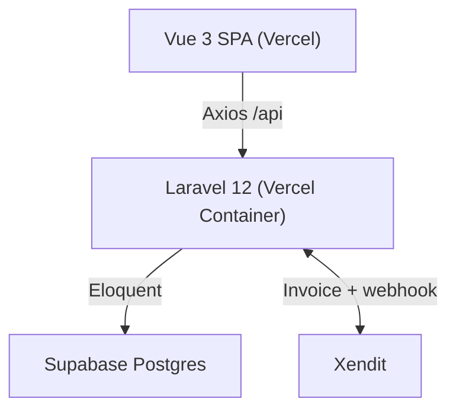

<div align="center">
  
  <h1>e-Ticket Sarangan</h1>
  <p>Digital ticketing & visitor management for Telaga Sarangan</p>
  <p>
    
    
    
    
    
  </p>
</div>

## Overview

Monorepo `Vue 3 SPA` + `Laravel 12 REST API` for Telaga Sarangan tourism.  
Auth via Sanctum, payments via **Xendit Invoice**, QR check-in, Supabase PostgreSQL, deployed as two Vercel projects.

**Flow:** `register/login` → `POST /orders` (quota check `lockForUpdate`) → Xendit invoice → webhook `PAID` → `qr_expires_at = visit_date 23:59` → `POST /scan` (once, `COMPLETED`) → admin/petugas dashboards.

Source of truth: `backend/routes/api.php`.

## Features

| Area | Status |
|------|--------|
| Auth (register/login/logout/me, `PATCH /auth/me`, forgot/reset via `Password::sendResetLink`) | ✅ |
| Orders, quota per date, history, QR (1 QR per order) | ✅ |
| **Xendit** invoice + webhook (`PAID/SETTLED→PAID`, `EXPIRED→EXPIRED`, `FAILED`) | ✅ (`XENDIT_CALLBACK_TOKEN` verified if set) |
| Scan QR (valid if `PAID`, not expired, not used) + `ScanLog` | ✅ |
| Admin: users, ticket types/categories, orders, payments (virtual), reports, accommodation CRUD | ✅ paginated `?search&per_page` + audit log |
| Accommodations: public catalog, user bookings, admin CRUD, **Xendit for bookings** (`ACC-` + `payment_url`), sync `accommodations:sync` (Google Places) | ✅ |
| Analytics (`GET /admin/analytics`), Audit Logs, Check-ins, Settings (`GET/PATCH /admin/settings`) | ✅ |
| Notifications (`GET /notifications`, bell polling 30s) | ✅ |
| Accommodations image upload (`image` multipart → `Storage` s3/public) | ✅ |
| Rate-limit `auth/login 5/min`, cron `orders:expire` & `accommodations:expire` hourly | ✅ |
| Ticket upgrades | ⚠️ legacy table (`ticket_upgrades`) — empty until used |

## Tech Stack

| Layer | Stack |
|-------|-------|
| Frontend | Vue 3 + Vite, TypeScript, Pinia, Vue Router, Tailwind CSS, vue-i18n, `qrcode.vue`, `vue-qrcode-reader`, `lucide-vue-next` |
| Backend | Laravel 12, PHP 8.3+, Sanctum 4.3, Pest 3, `xendit/xendit-php` |
| DB | Supabase PostgreSQL (`DB_SSLMODE=require`) |
| Infra | Vercel (SPA + Container), Docker FrankenPHP |

## Architecture



```
.
├── frontend/  Vue 3, Vite, TypeScript, Pinia
├── backend/   Laravel 12, Sanctum, Pest
└── docs/      architecture / database / Supabase
```

Domain model: `Order` (`ETK-YYYYMMDD-XXXXXX`) + `OrderItem`. `AuditLog`, `ScanLog`, `Notification`, `Accommodation` are active.

## Roles

Guard: `Vue Router` (`frontend/src/router/index.ts:222`) + `EnsureRole` middleware (`backend/app/Http/Middleware/EnsureRole.php:11`) `role:admin|petugas`.

| Role | Access |
|------|--------|
| wisatawan | `POST /orders`, `GET /orders`, `GET /orders/{code}`, `POST /accommodation-bookings`, `GET /accommodations`, notifications |
| petugas | `GET /petugas/*`, `POST /scan`, `GET /scan/history` (`role:petugas`) |
| admin | `GET|POST|PATCH|DELETE /admin/*` (`role:admin`) — users, ticket types/categories, accommodations, orders, payments, reports, analytics, audit-logs, checkins, upgrades, settings |

Seeder `php artisan db:seed` (`DatabaseSeeder.php:19`):
`admin@sarangan.test` / `petugas@sarangan.test` / `wisatawan@sarangan.test` — `password` (dev only).

## Quick Start

**Prereqs:** PHP 8.3 (`pdo_pgsql`), Composer 2, Node 20+, PostgreSQL/Supabase.

```bash
git clone https://github.com/Kanzacky/E-Ticket-Sarangan.git
cd E-Ticket-Sarangan
```

Backend:
```bash
cd backend
composer install
cp .env.example .env
php artisan key:generate
# edit .env: DB_*, XENDIT_SECRET_KEY, FRONTEND_URL, GOOGLE_PLACES_API_KEY (optional)
php artisan migrate --force
php artisan db:seed
php artisan serve # http://localhost:8000
php artisan accommodations:sync --limit=10 # optional Google Places
```

Frontend:
```bash
cd frontend
npm install
cp .env.example .env # VITE_API_URL=http://localhost:8000/api
npm run dev # http://localhost:5173
```

## Configuration

`.env` never committed. `frontend/.env.production` is committed for `VITE_API_URL`.

**Backend Vercel env:** `APP_KEY`, `APP_URL`, `DB_*`, `DB_SSLMODE=require`, `FRONTEND_URL`, `SANCTUM_STATEFUL_DOMAINS`, `XENDIT_SECRET_KEY`, `LOG_CHANNEL=stderr`  
Optional: `XENDIT_CALLBACK_TOKEN`, `GOOGLE_PLACES_API_KEY`, `AWS_*` (`FILESYSTEM_DISK=s3` for Supabase Storage), `CORS_ALLOWED_ORIGINS`, `AUTO_MIGRATE=true`

**Frontend:** `VITE_API_URL=https://e-ticket-sarangan-backend.vercel.app/api`

## API

Base `/api`, response `{success, message, data, meta}` (`App\Support\ApiResponse`).

| Method | Path | Auth |
|--------|------|------|
| `GET` | `/health`, `/ticket-types`, `/accommodations` | public |
| `POST` | `/auth/register`, `/auth/login`, `/auth/forgot-password`, `/auth/reset-password` | public (throttled) |
| `GET/PATCH` | `/auth/me` | sanctum |
| `GET/POST` | `/orders`, `/accommodation-bookings`, `/notifications` | sanctum |
| `POST` | `/scan`, `GET /scan/history` | petugas |
| `POST` | `/payments/xendit/webhook` | public (token if set) |
| `*` | `/admin/*` | admin |
| `*` | `/petugas/*` | petugas |

Full list: `backend/routes/api.php`.

Pagination: `?search=&per_page=15&page=1&status=` → `{data, meta:{current_page,last_page,total}}` (fallback to array if without `per_page`).

## Testing

```bash
cd backend
php artisan test          # Pest, sqlite :memory:
# 14 tests: AccommodationBooking, Notification (8), Analytics (6), Auth, etc.

cd frontend
npm run type-check
npm run lint
npm run build
```

CI: `.github/workflows/ci.yml` — backend pest + frontend build on push.

## Deployment

Two Vercel projects (root `frontend/`, `backend/`). Push to tracked branch triggers rebuild.  
Backend container runs `migrate --force --isolated` if `AUTO_MIGRATE=true` (`docker/entrypoint.sh:28`), then `php artisan optimize`.

CORS (`config/cors.php:36`): `https://e-ticket-sarangan.vercel.app`, `https://e-ticket-sarangan-anx4.vercel.app` + `FRONTEND_URL`/`CORS_ALLOWED_ORIGINS`.

## License

MIT — for Telaga Sarangan tourism.

<div align="center"><sub>Built for Telaga Sarangan</sub></div>
