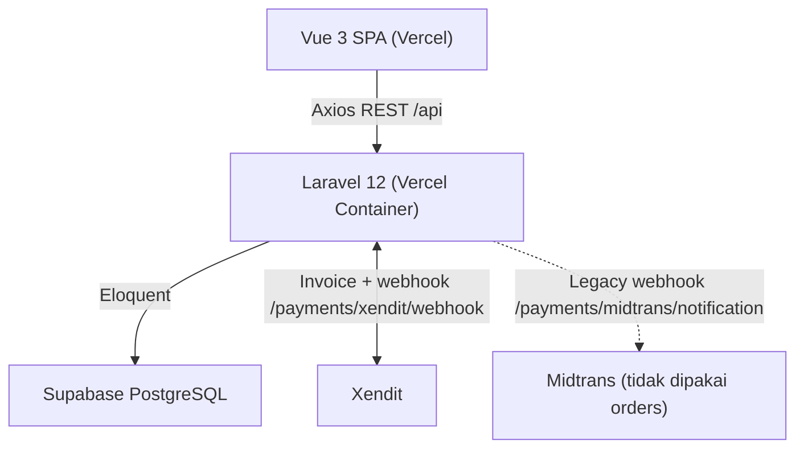

<div align="center">
  
  <h1>e-Ticket Sarangan</h1>
  <p>Sistem digital ticketing dan manajemen pengunjung untuk wisata Telaga Sarangan</p>

  <p>
    
    
    
    
  </p>
</div>

---

## Ikhtisar

**e-Ticket Sarangan** adalah monorepo klien–peladen: SPA Vue 3 berbicara ke REST API Laravel 12. Data tersimpan di **Supabase PostgreSQL**. Pembayaran tiket aktif memakai **Xendit Invoice** (SDK `xendit/xendit-php ^7.0`); QR tiket ditampilkan di frontend dan divalidasi petugas lewat pemindai.

Alur yang sudah berjalan end-to-end: daftar/login → pesan tiket (`orders` + `order_items`) → invoice Xendit → bayar → webhook → QR → scan petugas (sekali pakai, cek `qr_expires_at`) → kelola data di panel admin/petugas.

Production di-deploy sebagai **dua proyek Vercel** (frontend SPA + backend container), terhubung ke repo GitHub. Push ke branch yang di-track memicu rebuild. File `.env` lokal **tidak ikut** ke Git; kredensial production ada di Vercel Environment Variables.

## Status saat ini

Sudah operasional untuk demo/produksi terbatas (pesan–bayar–scan–CRUD + penginapan). Belum produk lengkap sesuai visi awal.

| Area | Kondisi |
|:---|:---|
| Auth Sanctum (register, login, logout, profil `GET/PATCH /auth/me`) | Ada |
| Pesan tiket, kuota per tanggal (`lockForUpdate` + cek `PENDING`+`PAID`), riwayat, QR | Ada (`orders` / `order_items`) — `backend/app/Http/Controllers/Api/V1/OrderController.php:59` |
| Pembayaran **Xendit** (invoice + webhook) | Ada; verifikasi `x-callback-token` masih dikomentari di `backend/app/Http/Controllers/Api/V1/XenditWebhookController.php:19` |
| Pembayaran **Midtrans** | Legacy; `midtrans/midtrans-php ^2.6` masih ter-install, `backend/app/Services/MidtransService.php:1`, `backend/config/midtrans.php:1`, webhook `POST /payments/midtrans/notification` mengarah ke model `Booking` dan **tidak dipakai** alur `orders` |
| Scan QR petugas + riwayat scan | Ada (satu QR per pesanan, bukan per orang). Validasi: `PAID` saja, cek `qr_expires_at`, tolak scan duplikat. `backend/app/Http/Controllers/Api/V1/ScannerController.php:17` + `ScanLog` |
| Admin: user, jenis tiket, kategori, order, pembayaran, laporan ringkas | Ada — `backend/app/Http/Controllers/Api/V1/Admin/` |
| Penginapan (katalog publik + booking kamar + CRUD admin) | Ada; belum terhubung pembayaran (kurangi `available_rooms` langsung, status `pending`) — `backend/app/Http/Controllers/Api/V1/AccommodationBookingController.php:32` |
| Analitik, audit log, upgrade tiket, detail tiket per pengunjung | Belum (UI placeholder / tabel lama `bookings`, `tickets`, `payments`, `checkins` masih ada di migrasi tapi tidak dipakai alur aktif) |
| Guard role di **API** | **Ada** — middleware `EnsureRole` alias `role` di `backend/bootstrap/app.php:22`, dipakai di `backend/routes/api.php:24` (`admin`), `:70` (`petugas`), `:95` (`scan`) |
| CI GitHub Actions, tes frontend | Belum |

Dokumen di `docs/api.md` dan `docs/database.md` masih menggambarkan fase fondasi. **Sumber kebenaran rute:** `backend/routes/api.php`.

## Arsitektur



| Folder | Isi |
|:---|:---|
| `frontend/` | Vue 3, Vite, TypeScript, Pinia, Vue Router, Tailwind CSS, vue-i18n, `qrcode.vue`, `vue-qrcode-reader` |
| `backend/` | Laravel 12, PHP 8.3+, Sanctum 4.3, Pest 3, `xendit/xendit-php`, `midtrans/midtrans-php` |
| `docs/` | Catatan arsitektur / DB / Supabase (sebagian belum diselaraskan dengan kode) |

Model domain aktif untuk tiket adalah **Order** (`ETK-YYYYMMDD-XXXXXX`) + `OrderItem`. Tabel lama (`bookings`, `booking_visitors`, `tickets`, `payments`, `checkins`, `ticket_upgrades`, `notifications`, `audit_logs`) masih ada di `backend/database/migrations/` untuk kompatibilitas, tapi webhook Midtrans saja yang masih menggunakannya.

## Peran pengguna

Guard dua lapis: Vue Router (`frontend/src/router/index.ts:222`) + middleware API `role` (`backend/app/Http/Middleware/EnsureRole.php:11`).

| Peran | Yang bisa dilakukan |
|:---|:---|
| **Wisatawan** (`role:wisatawan`) | Pesan tiket (`POST /orders`), lihat riwayat (`GET /orders`), detail QR (`GET /orders/{code}`), booking penginapan (`GET/POST /accommodation-bookings`), katalog penginapan publik (`GET /accommodations`), profil |
| **Petugas** (`role:petugas`) | Dashboard petugas `GET /petugas/dashboard`, kunjungan, booking list, scan QR `POST /scan`, riwayat scan `GET /scan/history` — semua di group `auth:sanctum` + `role:petugas` |
| **Admin** (`role:admin`) | CRUD User, TicketType, TicketCategory, Accommodation, Orders (`GET/PATCH /admin/orders`), Payments virtual (`GET/PATCH /admin/payments`), Reports `GET /admin/reports/summary`, Dashboard |

Akun seeder (`php artisan db:seed` → `backend/database/seeders/DatabaseSeeder.php:19`):
`admin@sarangan.test`, `petugas@sarangan.test`, `wisatawan@sarangan.test` — password default `password`. Jangan dipakai sebagai akun production nyata.

Seeder penginapan: 5 data dummy (`backend/database/seeders/AccommodationSeeder.php:12`) — lihat bagian Penginapan untuk mengganti dengan data real.

## Alur Pemesanan & Pembayaran (saat ini)

### 1. Buat Order + Invoice Xendit
`frontend/src/services/order.service.ts:15` → `POST /orders` (`backend/app/Http/Controllers/Api/V1/OrderController.php:38`)
- Validasi `visit_date` + `items: [{ticket_type_id, quantity}]`, konsolidasi duplikat `ticket_type_id`.
- `lockForUpdate` pada `TicketType`, hitung `bookedQuantity` (sum `quantity` di `order_items` where `visit_date` sama dan `status IN (PENDING,PAID)`), cek `quota - booked`.
- Generate `order_code` unik `ETK-YYYYMMDD-RANDOM6`, `total_quantity` + `total_amount`.
- `DB::transaction`: `Order::create` + `items().create`.
- Generate Xendit Invoice (`Xendit\Invoice\InvoiceApi`) — `OrderController.php:130`:
  ```php
  external_id = order_code
  amount = total_amount
  payer_email = customer_email
  description = "Pembayaran e-Ticket Sarangan - {code}"
  success_redirect_url = FRONTEND_URL/booking/success/{code}
  failure_redirect_url = FRONTEND_URL/booking/success/{code}
  ```
  Jika sukses simpan `payment_id` + `payment_url` ke `orders`, jika gagal tetap simpan order (log error). Frontend redirect ke `payment_url` (Xendit hosted invoice). Status awal `PENDING`.

### 2. Webhook Xendit
`POST /payments/xendit/webhook` alias `POST /webhook` → `backend/app/Http/Controllers/Api/V1/XenditWebhookController.php:16`
- Payload: `external_id` (order_code) + `status`. Verifikasi `x-callback-token` masih **disabled** (komentar baris 19-22) — segera aktifkan di production dengan env `XENDIT_CALLBACK_TOKEN` dan balikan 401 jika mismatch.
- Jika `PAID`/`SETTLED` dan order masih bukan `PAID`: set `status=PAID`, `qr_expires_at = visit_date 23:59:59` (`Carbon::parse(visit_date)->endOfDay()`).
- Jika `EXPIRED` dan masih `PENDING`: set `EXPIRED`.
- Return `200` bahkan jika order tidak ditemukan agar tombol Test di dashboard Xendit tidak retry loop.

### 3. QR & Scan
Order `PAID` menampilkan QR berisi `order_code` (`frontend/src/views/booking/` + `qrcode.vue`). Scan di `frontend/src/views/petugas/ScannerView.vue` → `POST /scan` (`frontend/src/services/scanner.service.ts:16`):
- Cek order ada, `status === PAID`, belum lewat `qr_expires_at`, belum pernah `scanned_at`.
- Jika valid: `scanned_at = now()`, `scanned_by = petugas.id`, `status = COMPLETED`, catat `ScanLog` valid.
- Jika tidak valid: catat `ScanLog` invalid + reason.
- Riwayat `GET /scan/history` per petugas.

### 4. Admin Payments (virtual)
`GET /admin/payments` (`backend/app/Http/Controllers/Api/V1/Admin/AdminPaymentController.php:12`) memetakan `Order` menjadi pembayaran (tidak ada tabel `payments` untuk alur baru):
`{ id: order.id, transaction_id: "TRX-"+order_code, amount: total_amount, status: order.status, paid_at: updated_at jika PAID/COMPLETED }`.
`PATCH /admin/payments/{id}/status` untuk override manual (`PAID,PENDING,COMPLETED,FAILED,CANCELLED`) — fallback jika webhook belum masuk.

> **Midtrans legacy:** `POST /payments/midtrans/notification` (`backend/app/Http/Controllers/Api/V1/PaymentCallbackController.php:17`) verifikasi `sha512(order_id+status_code+gross_amount+serverKey)`, cari `Booking` via `explode('-', order_id)[0]`, update `payments`/`bookings`. Tidak tersentuh UI `orders`. Biarkan untuk referensi atau hapus bila yakin tidak butuh.

## Penginapan

### Yang sudah ada
- Publik: `GET /accommodations`, `GET /accommodations/{id}` (`backend/app/Http/Controllers/Api/V1/AccommodationController.php:14` — hanya `is_active=true`, order by `rating`).
- User: `GET/POST /accommodation-bookings` (`AccommodationBookingController.php:32`) — validasi `check_in >= today`, `check_out > check_in`, cek `rooms <= available_rooms`, hitung `nights = check_in.diffInDays(check_out)`, `total_price = price_per_night * rooms * nights`, `booking_code=ACC-RANDOM8`, decrement `available_rooms`. Belum ada pembayaran / refund `available_rooms` saat cancel.
- Admin CRUD: `GET/POST/PATCH/DELETE /admin/accommodations` (`AdminAccommodationController.php:12`).
- Frontend: `frontend/src/views/wisatawan/AccommodationsView.vue`, `AccommodationDetailView.vue` + `frontend/src/services/accommodation.service.ts`; admin `frontend/src/views/admin/AccommodationsView.vue`.

### Menambahkan data real hotel/penginapan sekitar Telaga Sarangan

Data seeder sekarang hanya 5 dummy (Hotel Sarangan Indah, Villa Telaga Permai, dll. — `AccommodationSeeder.php:12`). Untuk data real ada 3 opsi, urut dari paling direkomendasikan:

**Opsi A — Input manual via panel Admin (paling cepat, tanpa coding):**
Login `admin@sarangan.test` → Admin → Accommodations → Create. Isi `name`, `description`, `address`, `phone`, `image_url`, `price_per_night`, `total_rooms`, `available_rooms`, `rating`, `facilities: ["WiFi",...]`, `is_active`. Cocok untuk <50 data.

**Opsi B — Ganti Seeder dengan data real (ter-version, bisa di-seed ulang):**
1. Kumpulkan data real (nama, alamat, HP, harga/malam, jumlah kamar, foto URL, rating Google, fasilitas) — bisa riset manual Google Maps / Traveloka / Tiket.com / Booking.com untuk area "Telaga Sarangan, Magetan". **Jangan scrape melanggar ToS** — catat manual + foto dengan izin.
2. Edit `backend/database/seeders/AccommodationSeeder.php:12` — ganti array `$data` dengan data real (minimal field yang sama).
3. `php artisan migrate:fresh --seed` (lokal) atau `php artisan db:seed --class=AccommodationSeeder` (tambah tanpa hapus). Untuk production Vercel: push ke Git + `AUTO_MIGRATE` atau jalankan seeder via `vercel exec` / artisan command.

**Opsi C — Integrasi API eksternal (otomatis, butuh key & mapping):**
Jika butuh data selalu up-to-date: pakai API resmi seperti **Google Places API** (`place_id` type `lodging` near `Telaga Sarangan -7.67,111.22`), **Traveloka/Tiket.com affiliate API**, atau **Booking.com API**. Buat command `php artisan accommodations:sync` yang fetch → upsert ke `accommodations` (map `name`, `vicinity`→`address`, `rating`, `photos`→`image_url`). Perlu env `GOOGLE_PLACES_API_KEY` + cron. Kelebihan: real-time; kekurangan: butuh API key berbayar, rate limit, perlu normalisasi harga/kamar (tidak selalu ada).

**Tidak disarankan:** scraping HTML Traveloka/Booking.com tanpa izin — melanggar ToS, struktur sering berubah, rawan blokir IP, dan masalah legal. Jika tetap butuh, gunakan hanya untuk riset internal lalu input manual, bukan fetch production.

> **Catatan stok kamar:** `AccommodationBookingController` langsung `available_rooms -= rooms` tanpa reservasi timeout. Untuk data real, pertimbangkan tambah kolom `check_in`/`check_out` overlap check + cron `EXPIRED` untuk melepas kamar yang `pending` melewati batas bayar (mirip flow `orders`).

## Production (GitHub → Vercel)

Tidak wajib menjalankan app di laptop agar Vercel ter-update. Yang di-push hanya **kode yang di-commit**.

1. Repo terhubung ke **dua** project Vercel (frontend root `frontend/`, backend root `backend/`).
2. Env production diisi di **dashboard Vercel**, bukan lewat commit `.env`.
3. Frontend build memakai `frontend/.env.production` (`VITE_API_URL=https://e-ticket-sarangan-backend.vercel.app/api`) atau override di Vercel.
4. Backend container menjalankan `php artisan migrate --force` saat start jika `AUTO_MIGRATE=true` (default di `backend/docker/entrypoint.sh`).

URL yang dipakai di kode / CORS (`backend/config/cors.php:36`):

- Frontend: `https://e-ticket-sarangan.vercel.app`, `https://e-ticket-sarangan-anx4.vercel.app`
- Backend: `https://e-ticket-sarangan-backend.vercel.app`
- Frontend memanggil API: `https://e-ticket-sarangan-backend.vercel.app/api`

Jika origin frontend Vercel **baru**, tambahkan ke env backend `FRONTEND_URL` atau `CORS_ALLOWED_ORIGINS` agar browser tidak memblokir request.

### Env yang tidak ikut Git

Diabaikan Git: `.env`, `.env.*` (kecuali `.env.example` dan `frontend/.env.production`).

**Backend (Vercel):** `APP_KEY`, `APP_URL`, `APP_ENV=production`, `APP_DEBUG=false`, koneksi Supabase (`DB_*`, `DB_SSLMODE=require`), `FRONTEND_URL`, `SANCTUM_STATEFUL_DOMAINS`, `XENDIT_SECRET_KEY`, `LOG_CHANNEL=stderr`. Opsional: `XENDIT_CALLBACK_TOKEN` (aktifkan verifikasi webhook), `CORS_ALLOWED_ORIGINS`, `AUTO_MIGRATE`.

**Frontend (Vercel atau `.env.production`):** `VITE_API_URL` harus mengarah ke backend production (`…/api`), bukan localhost.

Fitur baru yang butuh secret tambahan (misalnya SMTP untuk email, Google Places key untuk sync penginapan) harus ditambahkan di dashboard Vercel; push kode **tidak** membuat variabel itu sendiri.

## Menjalankan di lokal (opsional)

Untuk pengembangan lokal, bukan syarat deploy.

**Prasyarat:** PHP 8.3+ (`pdo_pgsql`, `pgsql`), Composer 2, Node.js 20.19+ (22 disarankan), NPM 10+, PostgreSQL (lokal atau Supabase).

```bash
git clone https://github.com/Kanzacky/E-Ticket-Sarangan.git
cd E-Ticket-Sarangan
```

Backend:

```bash
cd backend
composer install
cp .env.example .env
php artisan key:generate
# isi DB_* (Supabase pooler atau PostgreSQL lokal), XENDIT_SECRET_KEY, FRONTEND_URL
# opsional: XENDIT_CALLBACK_TOKEN untuk test webhook lokal (expose via ngrok)
php artisan migrate
php artisan db:seed   # buat admin/petugas/wisatawan + ticket types + 5 penginapan dummy
php artisan serve     # http://localhost:8000
```

Frontend:

```bash
cd frontend
npm install
cp .env.example .env
# VITE_API_URL=http://localhost:8000/api
npm run dev           # http://localhost:5173
```

Test webhook Xendit lokal: expose `http://localhost:8000` via `ngrok http 8000` lalu set Callback URL di dashboard Xendit ke `https://<ngrok>.ngrok.io/api/payments/xendit/webhook` + isi `XENDIT_CALLBACK_TOKEN` yang sama.

## API

Prefix: `/api`. Bentuk respons umum: `{ success, message, data, meta }` atau `{ success, message, errors }` (lihat `App\Support\ApiResponse`).

| Method | Path | Auth | Deskripsi |
|:---|:---|:---|:---|
| GET | `/health` | publik | Health check |
| GET | `/ticket-types` | publik | List jenis tiket aktif |
| GET | `/accommodations` | publik | List penginapan aktif |
| GET | `/accommodations/{id}` | publik | Detail penginapan |
| POST | `/auth/register` | publik | Daftar wisatawan |
| POST | `/auth/login` | publik | Login → `access_token` |
| POST | `/auth/logout` | Sanctum | Logout |
| GET | `/auth/me` | Sanctum | Profil |
| PATCH | `/auth/me` | Sanctum | Update profil |
| GET | `/orders` | Sanctum | Riwayat order milik user |
| POST | `/orders` | Sanctum | Buat order + invoice Xendit |
| GET | `/orders/{order_code}` | Sanctum | Detail order milik user |
| POST | `/scan` | Sanctum + petugas | Verifikasi QR |
| GET | `/scan/history` | Sanctum + petugas | Riwayat scan petugas |
| GET | `/accommodation-bookings` | Sanctum | Riwayat booking penginapan user |
| POST | `/accommodation-bookings` | Sanctum | Booking penginapan |
| POST | `/payments/xendit/webhook` | publik | Webhook Xendit (alias `POST /webhook`) |
| POST | `/payments/midtrans/notification` | publik | Webhook Midtrans legacy |
| GET | `/admin/users`, POST, GET/{id}, PATCH/{id}, DELETE/{id} | admin | CRUD user |
| GET | `/admin/ticket-types`, POST, PATCH/{id}, DELETE/{id} | admin | CRUD jenis tiket |
| GET | `/admin/ticket-categories`, POST, PATCH/{id}, DELETE/{id} | admin | CRUD kategori |
| GET | `/admin/orders`, GET/{code}, PATCH/{code}/status | admin | Kelola order |
| GET | `/admin/payments`, PATCH/{id}/status | admin | Kelola pembayaran virtual |
| GET | `/admin/reports/summary` | admin | Ringkasan laporan |
| GET | `/admin/dashboard` | admin | Dashboard ringkas |
| GET | `/admin/accommodations`, POST, GET/{id}, PATCH/{id}, DELETE/{id} | admin | CRUD penginapan |
| GET | `/petugas/dashboard` | petugas | Dashboard petugas |
| GET | `/petugas/visits`, `/petugas/bookings`, `/petugas/users` | petugas | Data petugas |

Daftar lengkap: `backend/routes/api.php`.

## Pengujian

Backend (Pest lewat Artisan):

```bash
cd backend
php artisan test
```

Frontend (belum ada unit/e2e; yang ada pengecekan tipe dan lint):

```bash
cd frontend
npm run type-check
npm run lint
```

## Dokumentasi lain

- [Arsitektur](docs/architecture.md)
- [Skema basis data](docs/database.md) — belum mencerminkan tabel `orders` / `scan_logs` secara lengkap
- [Supabase](docs/supabase.md)

---

<div align="center">
  <p>Dikembangkan untuk mendukung pariwisata <b>Telaga Sarangan</b>.</p>
</div>
