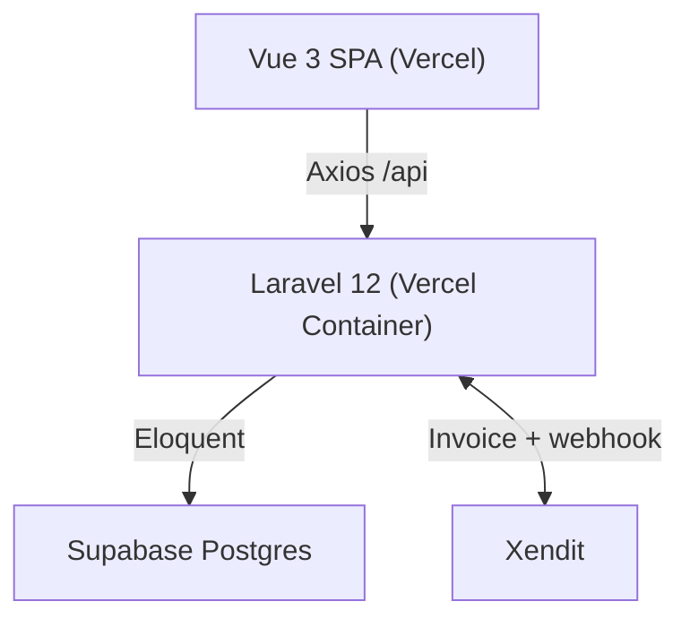

<div align="center">
  
  <h1>e-Ticket Sarangan</h1>
  <p>Sistem ticketing digital & manajemen pengunjung Telaga Sarangan</p>
  <p>
    
    
    
    
    
  </p>
</div>

## Ringkasan

Monorepo `Vue 3 SPA` + `Laravel 12 REST API` untuk wisata Telaga Sarangan.  
Autentikasi Sanctum, pembayaran **Xendit Invoice**, QR check-in, database Supabase PostgreSQL, deploy dua proyek Vercel.

**Alur:** `daftar/login` → `POST /orders` (cek kuota `lockForUpdate`) → invoice Xendit → webhook `PAID` → `qr_expires_at = visit_date 23:59` → `POST /scan` (sekali pakai, jadi `COMPLETED`) → dashboard admin/petugas.

Sumber kebenaran rute: `backend/routes/api.php`.

## Fitur

| Area | Status |
|------|--------|
| Auth (register/login/logout/me, `PATCH /auth/me`, lupa/reset via `Password::sendResetLink`) | ✅ |
| Pesan tiket, kuota per tanggal, riwayat, QR (1 QR per pesanan) | ✅ |
| **Xendit** invoice + webhook (`PAID/SETTLED→PAID`, `EXPIRED→EXPIRED`, `FAILED`) | ✅ (verifikasi `XENDIT_CALLBACK_TOKEN` jika di-set) |
| Scan QR (valid jika `PAID`, belum kedaluwarsa, belum dipakai) + `ScanLog` | ✅ |
| Admin: user, jenis tiket/kategori, pesanan, pembayaran (virtual), laporan, akomodasi | ✅ paginasi `?search&per_page` + audit log |
| Akomodasi: katalog publik, booking user, CRUD admin, **Xendit untuk booking** (`ACC-` + `payment_url`), sync `accommodations:sync` (Google Places) | ✅ |
| Analitik (`GET /admin/analytics`), Audit Log, Check-in, Pengaturan (`GET/PATCH /admin/settings`) | ✅ |
| Notifikasi (`GET /notifications`, bell polling 30 detik) | ✅ |
| Upload foto akomodasi (`image` multipart → `Storage` s3/public) | ✅ |
| Rate-limit `auth/login 5/menit`, cron `orders:expire` & `accommodations:expire` per jam | ✅ |
| Upgrade tiket | ⚠️ tabel legacy (`ticket_upgrades`) — kosong sampai digunakan |

## Teknologi

| Lapisan | Stack |
|---------|-------|
| Frontend | Vue 3 + Vite, TypeScript, Pinia, Vue Router, Tailwind CSS, vue-i18n, `qrcode.vue`, `vue-qrcode-reader`, `lucide-vue-next` |
| Backend | Laravel 12, PHP 8.3+, Sanctum 4.3, Pest 3, `xendit/xendit-php` |
| Basis Data | Supabase PostgreSQL (`DB_SSLMODE=require` untuk Supabase, `prefer` untuk lokal) |
| Infrastruktur | Vercel (SPA + Container), Docker FrankenPHP |

## Arsitektur



```
.
├── frontend/  Vue 3, Vite, TypeScript, Pinia
├── backend/   Laravel 12, Sanctum, Pest
└── docs/      arsitektur / basis data / Supabase
```

Model utama: `Order` (`ETK-YYYYMMDD-XXXXXX`) + `OrderItem`. Aktif: `AuditLog`, `ScanLog`, `Notification`, `Accommodation`.

## Hak Akses

Guard: `Vue Router` (`frontend/src/router/index.ts:222`) + middleware `EnsureRole` (`backend/app/Http/Middleware/EnsureRole.php:11`) `role:admin|petugas`.

| Peran | Akses |
|-------|-------|
| wisatawan | `POST /orders`, `GET /orders`, `GET /orders/{code}`, `POST /accommodation-bookings`, `GET /accommodations`, notifikasi |
| petugas | `GET /petugas/*`, `POST /scan`, `GET /scan/history` (`role:petugas`) |
| admin | `GET\|POST\|PATCH\|DELETE /admin/*` (`role:admin`) — user, jenis tiket/kategori, akomodasi, pesanan, pembayaran, laporan, analitik, audit-log, checkin, upgrade, pengaturan |

Seeder `php artisan db:seed` (`DatabaseSeeder.php:19`):
`admin@sarangan.test` / `petugas@sarangan.test` / `wisatawan@sarangan.test` — `password` (khusus dev).

## Mulai Cepat

**Prasyarat:** PHP 8.3 (`pdo_pgsql`), Composer 2, Node 20+, PostgreSQL/Supabase.

```bash
git clone https://github.com/Kanzacky/E-Ticket-Sarangan.git
cd E-Ticket-Sarangan
```

Backend:
```bash
cd backend
composer install
cp .env.example .env
php artisan key:generate
# isi .env: DB_*, XENDIT_SECRET_KEY, FRONTEND_URL, GOOGLE_PLACES_API_KEY (opsional)
php artisan migrate --force
php artisan db:seed
php artisan serve # http://localhost:8000
php artisan accommodations:sync --limit=10 # opsional Google Places
```

Frontend:
```bash
cd frontend
npm install
cp .env.example .env # VITE_API_URL=http://localhost:8000/api
npm run dev # http://localhost:5173
```

## Konfigurasi

`.env` tidak ikut Git. `frontend/.env.production` ikut Git untuk `VITE_API_URL`.

**Backend Vercel env:** `APP_KEY`, `APP_URL`, `DB_*`, `DB_SSLMODE=require`, `FRONTEND_URL`, `SANCTUM_STATEFUL_DOMAINS`, `XENDIT_SECRET_KEY`, `LOG_CHANNEL=stderr`  
Opsional: `XENDIT_CALLBACK_TOKEN`, `GOOGLE_PLACES_API_KEY`, `AWS_*` (`FILESYSTEM_DISK=s3` untuk Supabase Storage), `CORS_ALLOWED_ORIGINS`, `AUTO_MIGRATE=true`

**Frontend:** `VITE_API_URL=https://e-ticket-sarangan-backend.vercel.app/api`

**Lokal:** `DB_SSLMODE=prefer` (tanpa SSL). Supabase wajib `require`.

## API

Base `/api`, format `{success, message, data, meta}` (`App\Support\ApiResponse`).

| Metode | Path | Auth |
|--------|------|------|
| `GET` | `/health`, `/ticket-types`, `/accommodations` | publik |
| `POST` | `/auth/register`, `/auth/login`, `/auth/forgot-password`, `/auth/reset-password` | publik (rate-limit) |
| `GET/PATCH` | `/auth/me` | sanctum |
| `GET/POST` | `/orders`, `/accommodation-bookings`, `/notifications` | sanctum |
| `POST` | `/scan`, `GET /scan/history` | petugas |
| `POST` | `/payments/xendit/webhook` | publik (token jika di-set) |
| `*` | `/admin/*` | admin |
| `*` | `/petugas/*` | petugas |

Lengkap: `backend/routes/api.php`.

Paginasi: `?search=&per_page=15&page=1&status=` → `{data, meta:{current_page,last_page,total}}` (tanpa `per_page` fallback array).

## Pengujian

```bash
cd backend
php artisan test          # Pest, sqlite :memory: — 14 tes: AccommodationBooking, Notification (8), Analytics (6), Auth, dll.

cd frontend
npm run type-check
npm run lint
npm run build
```

CI: `.github/workflows/ci.yml` — backend pest + frontend build tiap push.

## Deployment

Dua proyek Vercel (root `frontend/`, `backend/`). Push ke branch ter-track trigger rebuild.  
Backend container jalan `migrate --force --isolated` jika `AUTO_MIGRATE=true` (`docker/entrypoint.sh:28`), lalu `php artisan optimize`.

CORS (`config/cors.php:36`): `https://e-ticket-sarangan.vercel.app`, `https://e-ticket-sarangan-anx4.vercel.app` + `FRONTEND_URL`/`CORS_ALLOWED_ORIGINS`.

## Lisensi

MIT — untuk pariwisata Telaga Sarangan.

<div align="center"><sub>Dibuat untuk Telaga Sarangan</sub></div>
